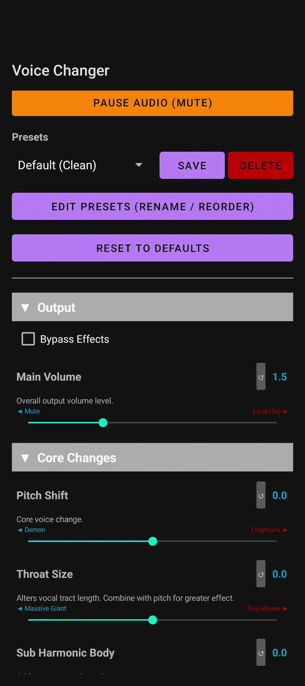

# Voice Changer Android App

A real-time Android voice changer built with Kotlin and C++. This app allows you to transform your voice using a range of effects. 

It is designed with a persistent foreground service to run silently in the background. This means you can create a custom voice profile and then minimize the app to use your altered voice simultaneously with whatever you see fit.

**IMPORTANT:** You **must** use headphones or a headset of some description while using this app. Using the phone's built in speakers will cause the microphone to pick up the altered voice, creating a harsh feedback loop.

## How to Run & Use the Application
1. Go to the **Releases** tab of this GitHub page.
2. Download the latest `.apk` file to your Android device.
3. Install the APK (you may need to allow installations from unknown sources in your browser settings).
4. **Plug in your headphones.**
5. Open the app and grant microphone access.
6. Adjust the DSP parameters to create a custom voice profile and hit **Save** to add it to your permanent presets.
7. Minimize the application. The background service will keep the audio engine active so you can use it while the phone is off or connected to something else.

## Key Features
*   **Low-Latency Audio:** Bypassed standard Android audio routing in favor of Google Oboe (C++).
*   **Background Execution:** Tied the audio engine to an Android Foreground Service so the OS doesn't kill the microphone process when minimized.
*   **Dynamic UI Generation:** Instead of hardcoding sliders in XML, the UI builds itself from the audio parameter lists. This keeps the frontend and DSP engine in sync and makes adding new effects easy.
*   **Asynchronous Storage:** Uses Jetpack DataStore to safely save, rename, reorder, and delete custom presets on a background thread.
*   **Custom DSP:** Built the core audio effects (Noise Gate, Pitch Shifting, EQs, ...) using Faust, compiling them directly into the C++ backend.

## Tech Stack 
*   **Frontend:** Kotlin / Android XML
*   **Audio Backend:** C++ (JNI) / Google Oboe
*   **DSP Engine:** Faust (Functional Audio Stream)
*   **Storage:** Jetpack DataStore

## System Requirements
*   **OS:** Android 8.0 (API 26) or higher
*   **Permissions Required:** Microphone, Foreground Service, Notifications (Android 13+)
*   **Hardware:** Headphones/Headset strictly required to prevent audio feedback
